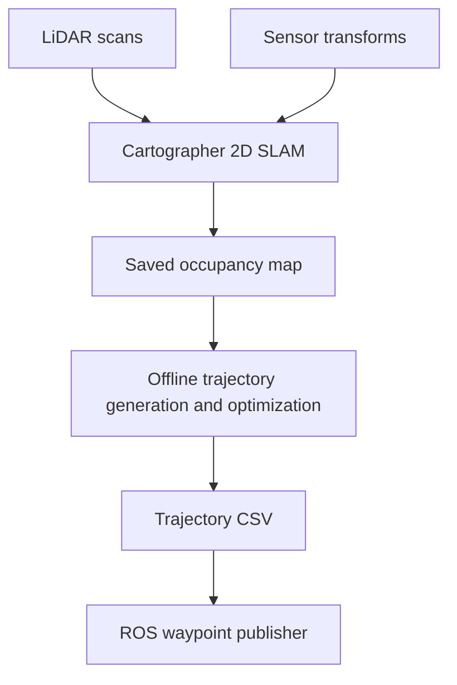
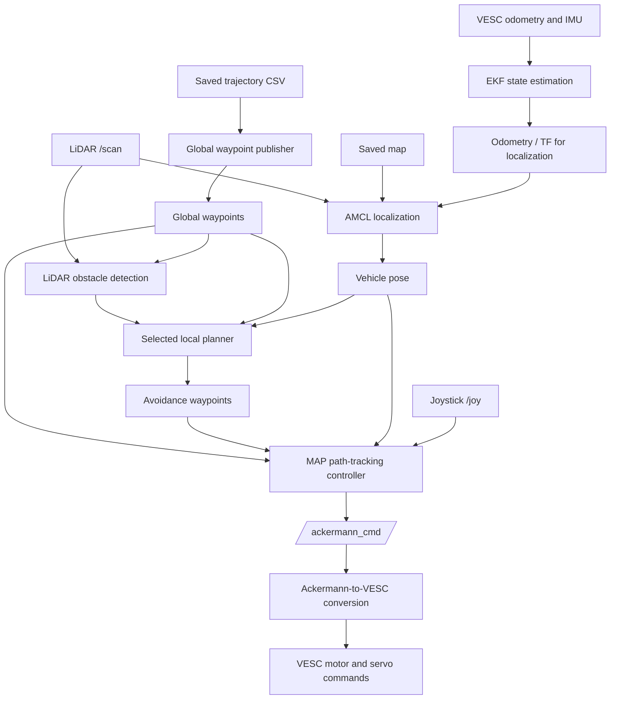

# F1TENTH Autonomous Driving

ROS 1-based autonomous racing software archive for an F1TENTH-scale vehicle, covering LiDAR perception, mapping, localization, trajectory generation, obstacle avoidance, path tracking, and VESC-based actuation.

## Project overview

This repository organizes source code, configuration files, launch files, maps, and trajectories used or investigated in an F1TENTH autonomous driving project. The vehicle uses an NVIDIA Jetson Orin Nano for onboard processing and a VESC-based interface for motor and steering control. Offline trajectory-generation tools were run separately on a laptop.

The repository brings together both original project work and adapted third-party packages. It is organized by function for study and documentation; **it is not a ready-to-build or independently verified ROS catkin workspace**.

### Technology stack

- **Middleware:** ROS 1 Noetic, catkin, ROS topics, TF
- **Languages and tools:** Python, C++, NumPy, SciPy, OpenCV (offline map/trajectory processing), YAML, CSV
- **Mapping:** Cartographer 2D SLAM
- **Localization and state estimation:** AMCL, `robot_localization` EKF, VESC odometry, IMU, LiDAR
- **Planning:** Offline trajectory generation and optimization, spline-based avoidance, lattice planning, Follow the Gap
- **Control:** MAP path-tracking controller, steering lookup table, Ackermann command interface
- **Vehicle hardware:** NVIDIA Jetson Orin Nano, LiDAR, VESC, drive motor, and steering servo

OpenCV is used in the archived **offline global-planning tools**; this does not imply that the real-time perception system uses camera-based object detection.

## System architecture

Mapping and autonomous driving are separate operational workflows. The following diagrams describe functional relationships, not a single verified launch configuration.

### 1. Mapping and trajectory preparation

The archived Cartographer Lua configuration disables Cartographer's direct odometry and IMU inputs. A separately configured EKF is not the same as enabling those inputs in Cartographer. The documented aliases do not verify every step of map export.

### 2. Autonomous driving

The diagram illustrates the intended data flow, rather than a fully integrated or validated pipeline. The AMCL/EKF topic remapping and TF configuration remain integration tasks. In the recorded driving workflow, the local-planning command starts `static_obs_spline_planner.py`. Other planners in this repository are alternatives and experiments rather than simultaneously active nodes.

During mapping teleoperation, a separate `joy.py` node can publish `/ackermann_cmd`; do not run multiple command publishers without an intentional command-selection mechanism.

## Main components

### Mapping

Cartographer provides 2D LiDAR-based mapping. The archive retains ROS launch files and Lua configuration for scan processing, sensor transforms, and occupancy-grid generation. Saved maps are used later for map-based localization and offline trajectory planning.

### Localization and state estimation

- **AMCL:** estimates the vehicle pose relative to a saved map from laser scans and TF.
- **EKF:** combines configured odometry and IMU measurements into a filtered state estimate.
- **TF:** represents relationships among the map, odometry, vehicle, and sensor coordinate frames.

AMCL pose and filtered odometry are different outputs. A consistent interface between the AMCL remap (`/odom/filtered`) and the EKF output (`/state_estimation/odom`) still needs to be configured and validated. This is an open integration task, not a confirmed runtime fault.

### Global planning

The archived F1TENTH racing-stack tools process track maps, extract track boundaries, and generate optimized trajectories offline. `main_globaltraj.py` selects the `mincurv_iqp` optimization mode in the preserved configuration. The vehicle-side `lane_visualize1.py` publishes a saved trajectory as ROS waypoints. Before reproducing trajectory generation, the map identifiers and input/output paths used by `lane_generator.py` and `config/params.yaml` still need to be aligned (currently `0816` versus `0824_final`).

### Perception

The ROS LiDAR detector processes laser scans in combination with global waypoints and transforms, then publishes obstacle geometry and visualization markers. The primary detection script is `detect_4.py`. This is a LiDAR-based perception pipeline; the archived detector should not be described as a camera or OpenCV object-detection system.

### Local planning

The archive retains several alternative obstacle-avoidance approaches:

- **Spline-based avoidance:** `static_obs_spline_planner.py`, used in the documented original driving workflow.
- **Lattice planning:** `lattice_planner3.py` and related variants for candidate-path-based local planning.
- **Following and overtaking experiments:** `lattice_planner_follow111.py` and `lattice_planner3_dynamic_overtake.py`.
- **Follow the Gap:** `follow_the_gap.py`, a LiDAR gap-based alternative.
- **Obstacle velocity estimation:** `obstacle_velocity_estimator.py` provides tracked-obstacle information for planners that require it.

These programs have different input assumptions. For example, `lattice_planner3.py` expects `/perception/detection/tracked_obstacles` by default, whereas several other variants consume raw obstacle detections. The obstacle-velocity estimation and tracked-obstacle publishing pipeline still needs to be connected and validated before running this lattice planner. Only the selected local planner should publish the avoidance reference used by the controller.

### Control

The archived `MAP_controller_real1.py` tracks the selected global or local reference and publishes Ackermann speed/steering commands. It receives joystick input for mode handling and uses steering lookup configuration. The controller can use fresh avoidance waypoints when available and fall back to the global reference according to its existing selection logic.

A separate `time_error_tracker.py` contains lap/time and path-error recording logic. Its input topics (`/car_state/pose` and `/global_waypoints`) differ from the main controller interface, so the required publishers or topic adapters still need to be implemented and tested before this tool can be used in the integrated workflow.

### Vehicle interface

The vehicle interface launches the VESC connection, odometry conversion, joystick support, and LiDAR interface. Ackermann commands are converted to VESC motor-speed and steering-position commands. The archived launch configuration includes vehicle-specific device paths, IP settings, steering calibration, and wheelbase parameters; these must be checked on the target vehicle.

## Repository structure

| Directory | Contents |
|---|---|
| [`f1tenth-mapping/`](f1tenth-mapping/README.md) | Cartographer launch files, Lua settings, and mapping TF configuration |
| [`f1tenth-localization/`](f1tenth-localization/README.md) | AMCL, EKF, map-server, and sensor TF launch configuration |
| [`f1tenth-perception/`](f1tenth-perception/README.md) | LiDAR obstacle detector, dynamic parameter configuration, and markers |
| [`f1tenth-planning/`](f1tenth-planning/README.md) | Offline global trajectory generation, waypoint publication, and alternative local planners |
| [`f1tenth-control/`](f1tenth-control/README.md) | MAP controller, steering lookup, and tracking-error recording |
| [`f1tenth-vehicle-interface/`](f1tenth-vehicle-interface/README.md) | VESC/Ackermann launch files, device startup, and joystick scripts |
| [`common-interfaces/`](common-interfaces/README.md) | Shared ROS message definitions |
| [`assets/`](assets/README.md) | Archived maps and trajectory data |
| [`docs/`](docs/README.md) | Recorded startup commands, source manifests, integration notes, and license notices |

## Primary ROS interfaces

The following are the documented root-namespace connections. Actual namespaces, remaps, and message definitions must be confirmed when restoring a runnable workspace.

| Topic | Message type | Purpose |
|---|---|---|
| `/scan` | `sensor_msgs/LaserScan` | LiDAR measurements for localization, detection, and selected planners |
| `/odom` | `nav_msgs/Odometry` | VESC-derived odometry input |
| `/sensors/imu/raw` | IMU message | IMU input configured for state estimation |
| `/state_estimation/odom` | `nav_msgs/Odometry` | Filtered EKF odometry |
| `/amcl_pose` | `geometry_msgs/PoseWithCovarianceStamped` | Map-relative localization output |
| `/global_path/optimal_trajectory_wpnt` | `f110_msgs/WpntArray` | Global trajectory waypoints |
| `/perception/detection/raw_obstacles` | `f110_msgs/ObstacleArray` | Detected obstacle geometry |
| `/perception/detection/tracked_obstacles` | `f110_msgs/ObstacleArray` | Estimated tracked obstacles for selected planners |
| `/planner/avoidance/otwpnts` | `f110_msgs/OTWpntArray` | Local avoidance waypoints |
| `/planner/avoidance/mode` | `std_msgs/String` | Mode output from selected local-planner variants |
| `/joy` | `sensor_msgs/Joy` | Joystick input |
| `/ackermann_cmd` | `ackermann_msgs/AckermannDriveStamped` | Requested vehicle speed and steering |
| `/commands/motor/speed` | VESC command topic | Converted motor-speed command |
| `/commands/servo/position` | VESC command topic | Converted steering-servo command |

## Original operating workflow

The repository retains a historical set of Nano commands in [`docs/README.md`](docs/README.md). Their original sequence was:

1. Start VESC, odometry, joystick, and LiDAR interfaces.
2. Start Ackermann-to-VESC conversion.
3. Start localization (AMCL, EKF, and relevant TF/map configuration).
4. Publish the saved global trajectory.
5. Start the MAP controller.
6. Start the LiDAR obstacle detector.
7. Start **one** selected local planner (the documented command uses `static_obs_spline_planner.py`).

Mapping has a separate joystick/Cartographer startup workflow. These are **historical command references**, not verified instructions for launching the reorganized repository as-is.

### Before attempting to run

- Recreate or adapt the original ROS 1 Noetic catkin workspaces and install external ROS dependencies.
- Build and source the necessary custom messages, controller dependencies, and VESC drivers.
- Update hard-coded absolute paths for workspaces, saved maps, CSV trajectories, and launch includes.
- Check the serial device, LiDAR network address, steering lookup, wheelbase, and VESC calibration against the actual vehicle.
- Resolve any inconsistencies in TF ownership, AMCL/EKF remaps, and expected odometry topics.
- Confirm that all input topics are available and avoid simultaneously launching competing avoidance or Ackermann command publishers.
- Validate functionality progressively: hardware interfaces, sensors, localization, waypoint publishing, perception, local planning, and finally control.

### Development roadmap and pending integration

The following items are **planned integration and validation tasks**, not features claimed to be working in the archived configuration:

| Area | Planned work | Intended outcome |
|---|---|---|
| Localization | Align the AMCL launch remap that references `/odom/filtered` with the EKF output `/state_estimation/odom`. Review TF frames and introduce a remap or compatible publisher where required. | AMCL can consume the intended filtered odometry and maintain consistent map/odom transforms. |
| Local planning | Provide `/perception/detection/tracked_obstacles` for `lattice_planner3.py`, including connecting and validating `obstacle_velocity_estimator.py` if tracked-obstacle estimates are required. | The selected lattice planner receives the obstacle data it expects and can evaluate avoidance trajectories. |
| Global planning | Reconcile the map identifiers `0816` in `lane_generator.py` and `0824_final` in `config/params.yaml`; update related map and trajectory file paths for a single selected track. | Offline generation and vehicle-side waypoint publishing reference compatible map/trajectory assets. |
| Control and evaluation | Implement or remap publishers for `/car_state/pose` and `/global_waypoints` as needed by `time_error_tracker.py`, then validate their message types and timing. | Tracking-error and lap-time evaluation can run against the integrated controller pipeline. |

These tasks are based on differences in the archived configuration and expected interfaces. They do **not** establish that the historical system failed to run; a working original environment may have contained additional remaps, publishers, or configuration not captured in this reorganized archive.

The copied scripts and launch files have not been collectively rebuilt or tested from their current directory locations.

## Development and integration scope

Project work included integrating LiDAR perception, localization, waypoint publication, path tracking, and VESC control; testing and tuning the autonomous driving pipeline; and modifying local obstacle-avoidance logic and parameters during development. The archived lattice, spline, and overtaking files reflect different development stages and experiments.

**Attribution boundary:** the presence of a file in this repository does not mean its entire implementation was written by the repository owner. Detailed authorship of individual algorithms and modifications should be established from source history and upstream comparisons before assigning personal credit.

## External sources and licensing

This repository includes or adapts components from external autonomous-racing and ROS projects, including an archived F1TENTH racing stack, MAP Controller, and VESC-related packages. Original attribution and license materials are retained under [`docs/source-notices/`](docs/source-notices/).

Review the applicable upstream licenses and preserve required notices before redistributing or repackaging third-party source files. The notices in this archive are not yet a complete verified per-file provenance inventory.

## Archive status

This repository documents a previously used ROS 1 F1TENTH development environment. It should not be confused with a separate ROS 2 / Jazzy stack or treated as an immediately reproducible end-to-end launch. The README describes the archived modules and their intended connections; complete integration and hardware execution remain environment-dependent.
