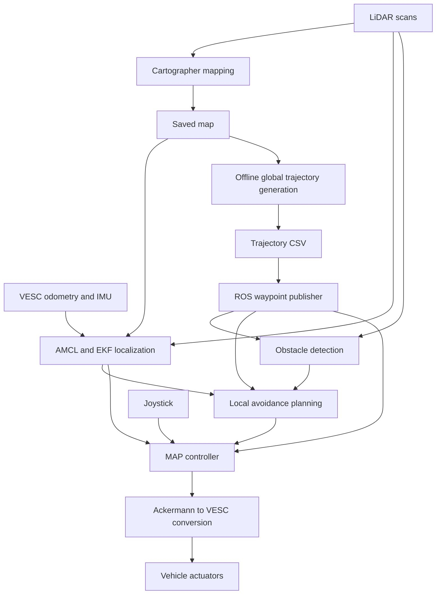

# F1TENTH Autonomous Driving

## Purpose and technologies

This repository organizes the source files, launch configurations, maps, and trajectories used in a F1TENTH autonomous driving project. The system combines mapping, localization, LiDAR obstacle detection, global trajectory generation, local obstacle avoidance, and MAP path tracking on a Nano vehicle computer, with offline trajectory generation on a laptop.

The archived software uses ROS 1, catkin, Python, C++, TF, AMCL, robot_localization, Cartographer, and VESC interfaces. The mapping commands explicitly reference ROS Noetic. Additional Python libraries are used for numerical computation, trajectory processing, and visualization.
## System architecture

This diagram describes the intended functional flow. Mapping and driving are separate operating workflows. It does not imply that the archived launch sequence is complete or has been validated in the reorganized repository.

## Repository layout

| Folder | Role |
|---|---|
| [Localization](f1tenth-localization/README.md) | AMCL, EKF, map loading, and sensor TF configuration |
| [Perception](f1tenth-perception/README.md) | LiDAR obstacle detection |
| [Planning](f1tenth-planning/README.md) | Offline global paths, ROS path publication, and local avoidance alternatives |
| [Control](f1tenth-control/README.md) | MAP path following and steering lookup |
| [Mapping](f1tenth-mapping/README.md) | Cartographer launch and Lua configuration |
| [Vehicle interface](f1tenth-vehicle-interface/README.md) | Vehicle startup and joystick command conversion |
| [Common interfaces](common-interfaces/README.md) | Shared ROS message definitions |
| [Assets](assets/README.md) | Maps and trajectory data |
| [Documentation](docs/README.md) | Workflow reference, backup records, and source notices |

## Execution status and workflow

This is a source archive organized by function, not a ready-to-build catkin workspace. Source locations and ROS package names are not interchangeable. External drivers and localization/mapping packages are not fully included. Before running, update the absolute paths in launch files, Python scripts, and commands to match your workspace, map, and trajectory locations.

The [workflow reference](docs/README.md) records the original Nano commands. Before reproducing them, restore or adapt the ROS workspaces, build and source their dependencies, update file paths for your environment, and configure the required topic connections. Commands in the module READMEs describe the original environment or explicitly conditional examples; they have not been executed as part of documentation preparation.

The main driving connections are:

| Topic | Message | Connection |
|---|---|---|
| `/scan` | `sensor_msgs/LaserScan` | LiDAR to localization, detection, and selected planners |
| `/amcl_pose` | `geometry_msgs/PoseWithCovarianceStamped` | Localization to controller and selected planners |
| `/global_path/optimal_trajectory_wpnt` | `f110_msgs/WpntArray` | CSV publisher to detection, planning, and control |
| `/perception/detection/raw_obstacles` | `f110_msgs/ObstacleArray` | Detection to avoidance or velocity estimation |
| `/planner/avoidance/otwpnts` | `f110_msgs/OTWpntArray` | Selected avoidance planner to controller |
| `/ackermann_cmd` | `ackermann_msgs/AckermannDriveStamped` | Controller or mapping joystick node to VESC conversion |

Do not assume the alternatives should run together.

## Source notices

The archive contains external code and project configuration. Preserved license texts are in [docs/source-notices](docs/source-notices/). Source attribution and external package review remain pending. Existing upstream documentation and source notices are retained.
